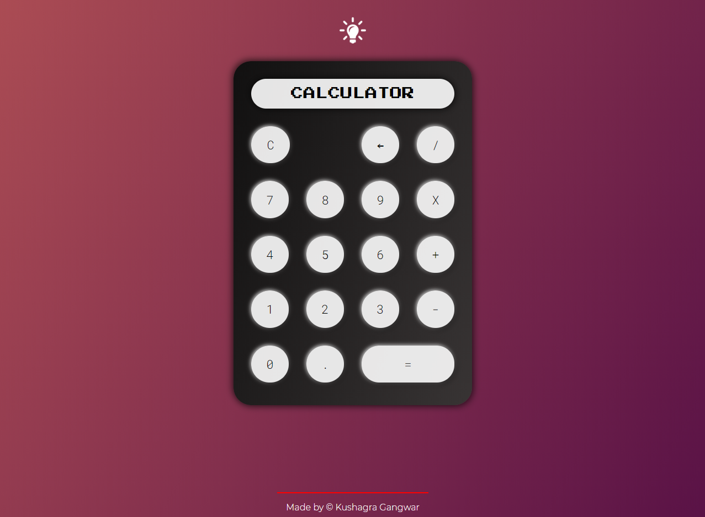
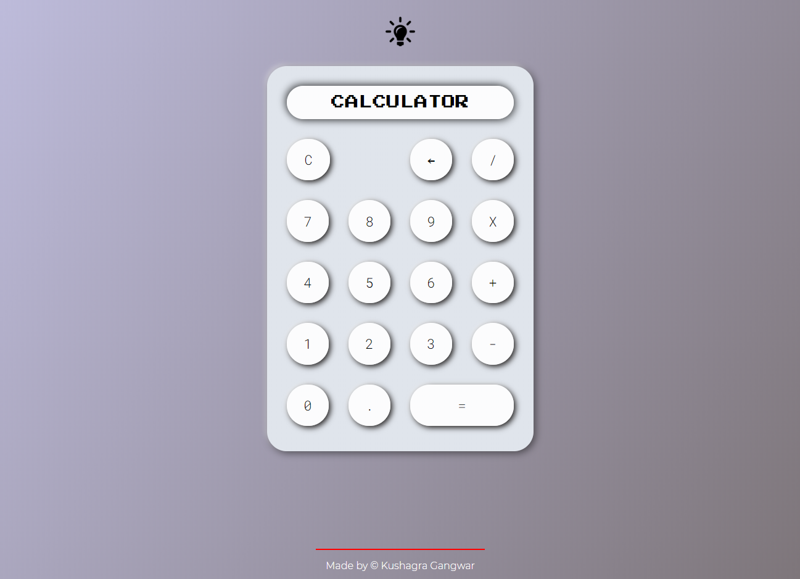

# neumo_calci

It's a simple calculator made with **JS,HTML and CSS** with a **neumorphic** styling. In addition to basic functionality of a calculator, it has two additional features :

1. Toggle **Dark/Light** Mode
2. Calculation according to **BODMAS** rule.

## Screenshots

> ### Dark Mode

> ### Light Mode

